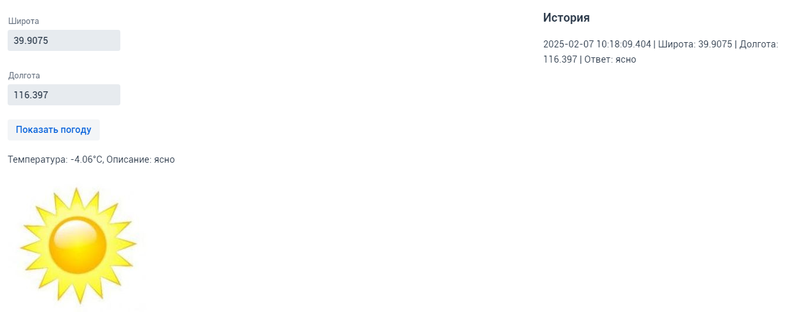
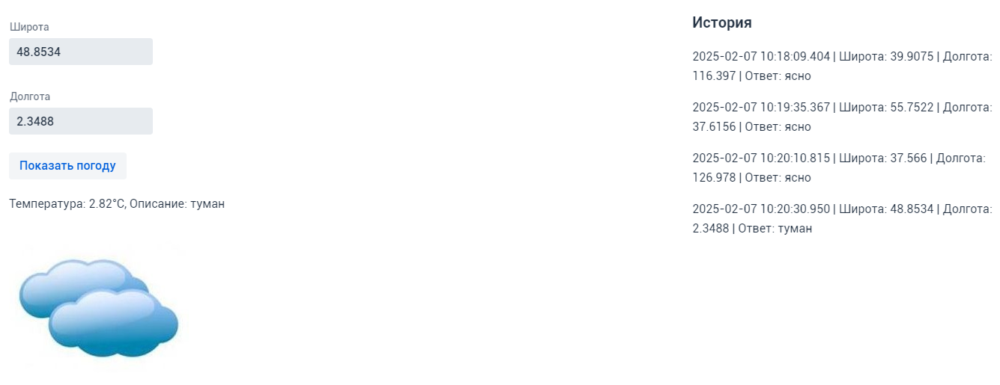

# Инструкция

У вас должна быть установлена Java не ниже версии 17<br/>
У вас должен быть установлен Maven последней версии

1. Настройте токен OpenWeatherMap<br/>
   В файле ***\src\main\resources\application.properties*** замените ***YOUR_TOKEN*** на ваш токен от OpenWeatherMap:<br/>
   ```openweathermap.api.key=YOUR_TOKEN```
   
2. Соберите проект<br/>
   Откройте терминал в корневой директории проекта (где находится ***pom.xml***) и выполните команду:<br/>
   ```mvn clean install```

3. После успешной сборки проекта выполните одну из следующих команд<br/>
   ```mvn spring-boot:run``` (через Maven)<br/>
   ```java -jar target/weather-app-1.0-SNAPSHOT.jar``` (как исполняемый JAR-файл)

4. Запустите приложение в своём браузере<br/>
   Перейдите по адресу:<br/>
   ```http://localhost:8080```<br/>
   Вы также можете проверить H2-консоль по адресу:<br/>
   ```http://localhost:8080/h2-console```<br/>
   Настройки БД по умолчанию (можно поменять в ***\src\main\resources\application.properties***):<br/>
   ```
   JDBC URL: jdbc:h2:mem:weatherdb
   Username: admin 
   Password: password
   ```
---------------------------------------------------------------------------------
<br/>
---------------------------------------------------------------------------------
<br/>
---------------------------------------------------------------------------------
